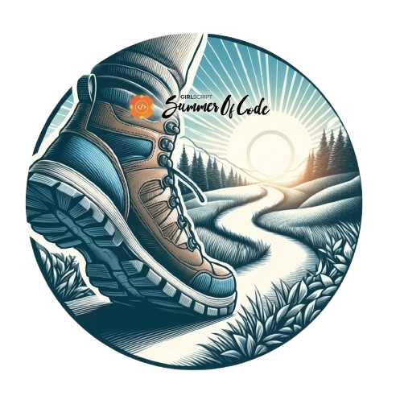
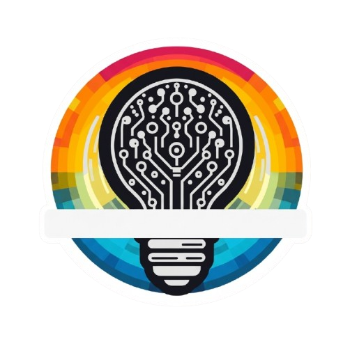

<div align="center">
  <a href="https://adarsh-portfolio-03.vercel.app/" target="_blank">
    
  </a> 
<pre>Click the banner to view My Portfolio.
</pre>


</div>


## 🎯 Professional Overview

**BTech Computer Science & Engineering** | **4th Year** | **NIT Manipur**

> Dedicated student and full stack developer with expertise in scalable web development and emerging technologies. Passionate about creating real-world solutions and advancing in machine learning and artificial intelligence.

--- 


## 🛠️ Technical Expertise

<div align="center">

### Programming Languages


### Frontend Development


### Backend & Database


### Styling & Tools


</div>

<h2>🚀 Featured Projects</h2>

<p>
A few things I've built that reflect my learning, problem-solving,
and experience across full-stack development, AI, and open source.
</p>

<table>
<tr>

<!-- ==================== VIDYATRACK ==================== -->

<td width="33%" valign="top">

<h3>📚 VidyaTrack</h3>

<p>
A full-stack platform connecting students and educators through courses, mentorship, resources, and AI-powered learning.
</p>

<p>


</p>

<br>
<br>
<p>
<a href="https://vidya-track-xi.vercel.app/">

</a>
<a href="https://github.com/Adarsh-Chaubey03/VidyaTrack">

</a>
</p>

</td>


<!-- ==================== PATHSENSE AI ==================== -->

<td width="33%" valign="top">

<h3>🛡️ PathSense AI</h3>

<p>
A privacy-first mobile system using sensor-based AI for fall detection and emergency response.
</p>
<br>
<p>


</p>

<br>
<br>
<p>
<a href="https://github.com/Adarsh-Chaubey03/PathSense-AI">

</a>
</p>

</td>


<!-- ==================== DBMS KEY ANALYZER ==================== -->

<td width="33%" valign="top">

<h3>🔑 DBMS Key Analyzer</h3>

<p>
A web application for computing candidate keys and superkeys from relational schemas and functional dependencies.
</p>
<br>
<p>


</p>

<br>

<p>
<a href="https://key-analyzer-rdbms.onrender.com/">

</a>
<a href="https://github.com/Adarsh-Chaubey03/Key-Analyzer-RDBMS">

</a>
</p>

</td>

</tr>


<tr>

<!-- ==================== VAIDYATEK ==================== -->

<td width="33%" valign="top">

<h3>🏥 VaidyaTek</h3>

<p>
An AI-powered healthcare platform connecting patients, doctors, labs, and pharmacies through real-time services.
</p>

<p>


</p>

<br>

<p>
<a href="https://vaidyatek.shop/">

</a>
<a href="https://github.com/Adarsh-Chaubey03/VaidyaTech-Hackathon-Project">

</a>
</p>

</td>


<!-- ==================== TRAVELGRID ==================== -->

<td width="33%" valign="top">

<h3>🌍 TravelGrid</h3>

<p>
An open-source travel platform for planning, customizing, and booking trips with AI-powered assistance.
</p>

<p>


</p>

<br>

<p>
<a href="https://travel-grid.vercel.app/">

</a>
<a href="https://github.com/Adarsh-Chaubey03/TravelGrid">

</a>
</p>

</td>


<!-- ==================== AI CRIME INTELLIGENCE ==================== -->

<td width="33%" valign="top">

<h3>🔐 AI Crime Intelligence</h3>

<p>
An AI-powered decision-support platform for crime prediction, threat detection, behavioral analysis, and forensics.
</p>

<p>


</p>

<br>

<p>
<a href="https://github.com/Adarsh-Chaubey03/Crime-Analysis">

</a>
</p>

</td>

</tr>
</table>

<br>

<p align="center">
<a href="https://github.com/Adarsh-Chaubey03?tab=repositories">

</a>
</p>


---


## 🏆 Achievements & Recognition
<div align="center">

### 🏆 GirlScript Summer of Code

<b>Project Admin · GSSoC 2025 (Rank 2)</b>

<p>
Served as <b>Project Admin</b> in GirlScript Summer of Code 2025.  
Led the project, which secured <b>Rank 2</b> among all participating projects.
</p>

<br/>

<b>Contributor · GSSoC Extended 2024</b>

<p>
Recognized as a <b>Top Contributor</b> in GirlScript Summer of Code Extended 2024 for consistent and high-quality open-source contributions.
</p>

<div align="center">

  
  
  
  
  
  
  

</div>

</div>


---

## 🎯 Core Competencies

```javascript
const adarsh = {
    education: {
        degree: "BTech Computer Science & Engineering",
        institution: "NIT Manipur",
        year: "Final Year",
        CGPA: 8.81
    },

    experience: {
        role: "Full Stack Developer Intern",
        company: "KHATAKHAT E-Logistic Pvt. Ltd.",
        status: "Completed",
        focus: [
            "B2B-to-B2C platform transition",
            "Backend workflow and REST API development",
            "Payment, OTP, CORS, cart, order & delivery workflows",
            "State management and performance optimization",
            "Debugging, testing and deployment support"
        ]
    },

    openTo: {
        roles: [
            "Software Development Engineer (SDE)",
            "Software Engineer",
            "Full Stack Developer",
            "Frontend Developer",
            "Backend Developer"
        ]
    }
};
```


## 📫 Connect With Me

<div align="center">

[](https://www.linkedin.com/in/adarsh-chaubey/)
[](https://github.com/Adarsh-Chaubey03)
[](mailto:0310adarshchaubey@gmail.com)

**📧 Email**: 0310adarshchaubey@gmail.com  
**🎓 Institution**: National Institute of Technology, Manipur  
**💼 Open for**: Collaborations, Projects, and Learning Opportunities


 
</div>

---

<div align="center">
  
</div>

<div align="center">
  
</div>
